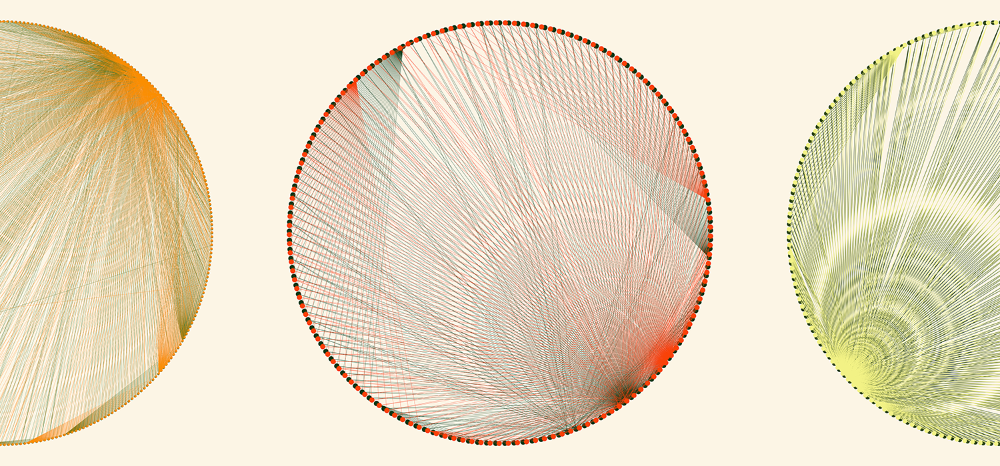

# Generative Art NFTs From Genomic Data

This code was used to:
1. Format and prepare publicly available genomic data for 3 pepper plants
2. Create animated pepper depictions using [Cytoscape.js](https://github.com/cytoscape/cytoscape.js) and [Anime.js](https://github.com/juliangarnier/anime/)
3. Deploy the animation index.htm files as NFTs on the Ethereum blockchain using a Solidity contract forked from [mondoir](https://github.com/mondoir/NFT-Smart-Contract)

---

* You can read about this motivations for this project in my [Medium post](https://towardsdatascience.com/creating-generative-art-nfts-from-genomic-data-16a48ae4df99)
* You can view the final depictions on [OpenSea](https://opensea.io/assets/0x86944176301532d4432b50838cea252e3b2990bb/1001)

---

* Source datasets are not included in this repo but can be downloaded from [NCBI](https://www.ncbi.nlm.nih.gov/assembly/?term=Capsicum) as described and fully referenced in the [post](https://towardsdatascience.com/creating-generative-art-nfts-from-genomic-data-16a48ae4df99)
* Days to harvest information was sourced from [Atlantic Pepper Seeds](http://pepperseeds.ca/index.php?route=information/information&information_id=14)
* See [tree.txt](https://github.com/s1monj/nft-peppers/blob/master/tree.txt) to recreate the same paths used in [wrangling.bash](https://github.com/s1monj/nft-peppers/blob/master/wrangling.bash)
* See [wrangling.bash](https://github.com/s1monj/nft-peppers/blob/master/wrangling.bash) for examples of bash commands as described in the [post](https://towardsdatascience.com/creating-generative-art-nfts-from-genomic-data-16a48ae4df99)
* The [web](https://github.com/s1monj/nft-peppers/tree/master/web) directory contains the final source files uploaded to IPFS
* The [deploy](https://github.com/s1monj/nft-peppers/tree/master/deploy) directory contains the metadata JSON files that reference the web files
* The [eth](https://github.com/s1monj/nft-peppers/tree/master/eth) directory contains the smart contract forked from [mondoir](https://github.com/mondoir/NFT-Smart-Contract) that he descibes in detail in his [Medium post](https://medium.com/@mondoir/your-very-own-smart-contract-for-nfts-b068b7d65e5d)

